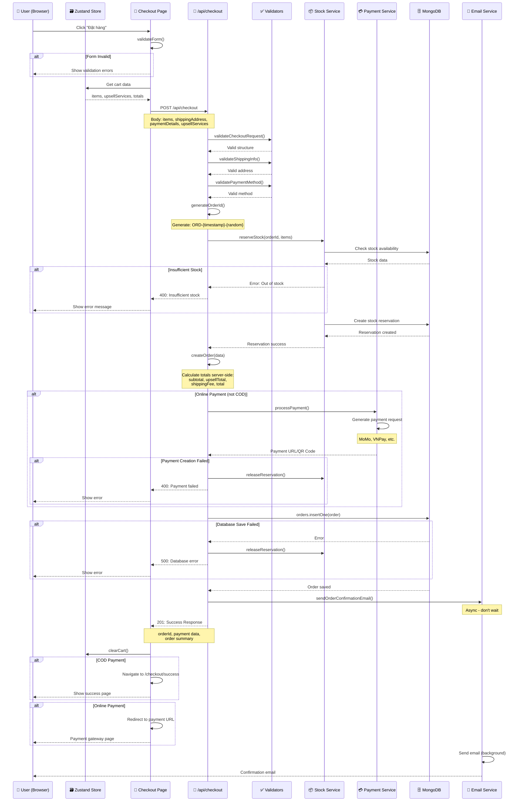

# 🔄 Data Flow Diagram - Order Checkout Process

**Project:** Teddy Shop E-commerce  
**Process:** Checkout Flow (Frontend → API → MongoDB)  
**Date:** December 4, 2025

---

## 📊 OVERVIEW

Luồng xử lý một đơn hàng mới từ lúc user nhấn "Đặt hàng" đến khi lưu vào MongoDB.

---

## 🎯 MERMAID DIAGRAM



---

## 🔄 DETAILED STEP-BY-STEP FLOW

### PHASE 1: Frontend Preparation 🖥️

**Location:** `src/app/(shop)/checkout/page.tsx`

#### Step 1.1: User Interaction
```
User fills form:
├── Shipping Info (name, phone, email, address)
├── Select payment method (COD, Bank Transfer, MoMo, VNPay)
└── Review cart items
```

#### Step 1.2: Form Validation (Client-side)
```typescript
validateForm() {
  ✅ fullName: required, min 2 chars
  ✅ phone: required, format: 0XXXXXXXXX
  ✅ email: required, valid email format
  ✅ address: required
  ✅ ward, district, city: required
}
```

#### Step 1.3: Prepare Request Data
```typescript
const requestBody = {
  guestEmail: shippingInfo.email,
  userId: user?.id,
  items: items,                    // From Zustand store
  shippingAddress: shippingInfo,
  shippingMethod: 'standard',
  upsellServices: upsellServices,  // From Zustand
  paymentDetails: {
    method: paymentMethod,
  },
  subtotal,                        // Client-calculated (will be verified)
  upsellTotal,
  shippingFee,
  total,
}
```

---

### PHASE 2: API Processing 🔌

**Location:** `src/app/(shop)/api/checkout/route.ts`

#### Step 2.1: Rate Limiting
```typescript
withRateLimit(handler, {
  windowMs: 60 * 1000,    // 1 minute
  maxRequests: 5,         // Max 5 checkout attempts
})
```
- 🛡️ Prevents abuse
- ⏱️ 5 requests per minute per IP

#### Step 2.2: Request Validation
```typescript
✅ validateCheckoutRequest(body)
   - items: array, not empty
   - shippingAddress: object with required fields
   - paymentDetails: object with method
   - guestEmail: string, valid email
   - upsellServices: object

✅ validateShippingInfo(shippingAddress)
   - All address fields present
   - Phone format: 0XXXXXXXXX
   - Email format valid

✅ validatePaymentMethod(method)
   - Valid methods: 'cod', 'bank_transfer', 'momo', 'vnpay'
```

#### Step 2.3: Generate Order ID
```typescript
generateOrderId() {
  timestamp = Date.now()           // 1733294400000
  random = Math.random() * 10000   // 0001-9999
  return `ORD-${timestamp}-${random}`
  // Result: "ORD-1733294400000-5678"
}
```

---

### PHASE 3: Stock Reservation 📦

**Location:** `src/lib/stock/reservation.ts`

#### Step 3.1: Check Stock Availability
```typescript
reserveStock(orderId, items) {
  FOR EACH item IN items:
    1. Find product in MongoDB
    2. Find variant by variantId
    3. Check: variant.stock >= item.quantity
    
    IF insufficient stock:
      RETURN { success: false, error: "Out of stock" }
}
```

**MongoDB Query:**
```javascript
// For each item
products.findOne({ 
  id: item.productId,
  isActive: true,
  'variants.id': item.variantId
})
```

#### Step 3.2: Create Stock Reservation
```typescript
IF all items have stock:
  stockReservations.insertOne({
    orderId: "ORD-1733294400000-5678",
    items: [
      {
        productId: "1",
        variantId: "v1-2",
        quantity: 2,
        reservedStock: 2
      }
    ],
    status: 'active',
    expiresAt: new Date(Date.now() + 15 * 60 * 1000), // 15 minutes
    createdAt: new Date()
  })
```

**Purpose:**
- 🔒 Temporarily locks stock
- ⏱️ Expires in 15 minutes if order not completed
- 🚫 Prevents overselling

---

### PHASE 4: Calculate Totals (Server-side) 💰

**Location:** API route - `createOrder()` function

```typescript
// ⚠️ CRITICAL: Always recalculate on server
// Never trust client-submitted totals!

subtotal = items.reduce((sum, item) => 
  sum + (item.price * item.quantity), 0
)

upsellTotal = upsellServices.isGiftWrapped 
  ? upsellServices.giftWrapFee 
  : 0

shippingFee = upsellServices.expressShipping 
  ? 50000   // Express: 50k VND
  : 30000   // Standard: 30k VND

total = subtotal + upsellTotal + shippingFee
```

**Example Calculation:**
```
Item 1: Gấu Teddy 1m2 × 1 = 350,000 VND
Item 2: Gấu Brown 80cm × 2 = 500,000 VND
─────────────────────────────────────────
Subtotal                      = 850,000 VND
Gift wrapping                 =  30,000 VND
Shipping (Standard)           =  30,000 VND
─────────────────────────────────────────
TOTAL                         = 910,000 VND
```

---

### PHASE 5: Payment Processing 💳

**Location:** `src/lib/payment/` services

#### Step 5.1: Payment Method Routing
```typescript
IF paymentMethod === 'cod':
  ✅ Skip payment processing
  order.paymentDetails.status = 'pending'

ELSE IF paymentMethod === 'momo':
  → processPayment('momo', paymentData)

ELSE IF paymentMethod === 'vnpay':
  → processPayment('vnpay', paymentData)

ELSE IF paymentMethod === 'bank_transfer':
  → Generate QR code (VietQR)
```

#### Step 5.2: Online Payment Flow (MoMo Example)
```typescript
processPayment('momo', {
  amount: 910000,
  orderId: "ORD-1733294400000-5678",
  description: "Thanh toán đơn hàng ORD-...",
  returnUrl: "/checkout/success?orderId=...",
  notifyUrl: "/api/payment/momo/callback"
})

MoMo API Response:
{
  success: true,
  paymentUrl: "https://test-payment.momo.vn/...",
  qrCode: "data:image/png;base64,...",
  transactionId: "MM-123456789"
}
```

**IF payment creation fails:**
```typescript
→ releaseReservation(orderId)
→ Return error to client
```

---

### PHASE 6: Save to MongoDB 🗄️

**Location:** MongoDB `orders` collection

#### Step 6.1: Prepare Order Document
```typescript
order = {
  orderId: "ORD-1733294400000-5678",
  guestEmail: "customer@email.com",
  userId: "user123" | undefined,
  
  items: [
    {
      productId: "1",
      variantId: "v1-2",
      name: "Gấu Bông Teddy",
      size: "1m2",
      price: 350000,        // Snapshot price
      quantity: 1,
      image: "/images/teddy-1m2.jpg"
    }
  ],
  
  shippingAddress: {
    fullName: "Nguyễn Văn A",
    phone: "0901234567",
    email: "customer@email.com",
    address: "123 Đường ABC",
    ward: "Phường 1",
    district: "Quận 1",
    city: "TP. Hồ Chí Minh",
    note: "Giao giờ hành chính"
  },
  
  shippingMethod: "standard",
  shippingFee: 30000,
  
  upsellServices: {
    vacuumSealing: false,
    isGiftWrapped: true,
    giftWrapFee: 30000,
    expressShipping: false
  },
  
  subtotal: 850000,
  upsellTotal: 30000,
  shippingTotal: 30000,
  total: 910000,
  
  paymentDetails: {
    method: "momo",
    status: "pending",
    amount: 910000,
    transactionId: "MM-123456789"  // If online payment
  },
  
  orderStatus: "pending",
  
  createdAt: new Date("2024-12-04T10:00:00Z"),
  updatedAt: new Date("2024-12-04T10:00:00Z")
}
```

#### Step 6.2: Insert to MongoDB
```typescript
try {
  const { orders } = await getCollections();
  await orders.insertOne(order);
  
  // Success! Order saved
} catch (dbError) {
  // Rollback: Release stock reservation
  await releaseReservation(orderId);
  throw new Error('Database save failed');
}
```

**MongoDB Operation:**
```javascript
db.orders.insertOne({
  orderId: "ORD-1733294400000-5678",
  guestEmail: "customer@email.com",
  // ... (full order document)
})

// Result:
{
  acknowledged: true,
  insertedId: ObjectId("674fc1234567890abcdef123")
}
```

---

### PHASE 7: Email Notification 📧

**Location:** `src/lib/email/` service

```typescript
// Async - don't wait (fire and forget)
sendOrderConfirmationEmail({
  order: order,
  customerName: "Nguyễn Văn A",
  customerEmail: "customer@email.com"
}).catch(error => {
  // Log error but don't fail checkout
  console.error('Email send failed:', error);
});
```

**Email Content:**
```
Subject: Xác nhận đơn hàng #ORD-1733294400000-5678

Dear Nguyễn Văn A,

Cảm ơn bạn đã đặt hàng tại The Emotional House!

Mã đơn hàng: ORD-1733294400000-5678
Tổng tiền: 910,000 VND
Phương thức: MoMo
Trạng thái: Chờ thanh toán

Chi tiết đơn hàng: [Link]
```

---

### PHASE 8: Response to Client 📤

#### Success Response (201 Created):
```json
{
  "success": true,
  "data": {
    "orderId": "ORD-1733294400000-5678",
    "order": {
      "id": "ORD-1733294400000-5678",
      "status": "pending",
      "total": 910000,
      "itemCount": 3,
      "paymentMethod": "momo",
      "estimatedDelivery": "2024-12-08T10:00:00Z"
    },
    "payment": {
      "paymentUrl": "https://test-payment.momo.vn/...",
      "qrCode": "data:image/png;base64,...",
      "transactionId": "MM-123456789"
    },
    "message": "Đơn hàng đã được tạo thành công"
  }
}
```

#### Error Response (400/500):
```json
{
  "success": false,
  "error": "Insufficient stock",
  "details": {
    "message": "Only 1 items available in stock"
  }
}
```

---

### PHASE 9: Frontend Handling 🎯

**Location:** `src/app/(shop)/checkout/page.tsx`

```typescript
// Success handling
if (response.ok) {
  const { data } = await response.json();
  
  clearCart();  // Clear Zustand store
  
  IF paymentMethod === 'cod':
    router.push(`/checkout/success?orderId=${data.orderId}`);
  
  ELSE IF has payment.paymentUrl:
    window.location.href = data.payment.paymentUrl;
  
  ELSE IF has payment.qrCode:
    // Show QR code modal
    showQRCodeModal(data.payment);
}

// Error handling
else {
  const { error } = await response.json();
  alert(error);
}
```

---

## 📊 ASCII FLOW DIAGRAM

```
┌──────────────────────────────────────────────────────────────┐
│                      CHECKOUT FLOW                            │
└──────────────────────────────────────────────────────────────┘

   👤 USER
    │
    │ 1. Fill form & click "Đặt hàng"
    ↓
┌─────────────────────┐
│  Checkout Page      │
│  (Client-side)      │
│                     │
│  • Get cart data    │◄─── Zustand Store (items, upsellServices)
│  • Validate form    │
│  • Prepare payload  │
└──────────┬──────────┘
           │
           │ POST /api/checkout
           │ Body: { items, shippingAddress, paymentDetails, upsellServices }
           ↓
┌─────────────────────┐
│   API Route         │
│   /api/checkout     │
│                     │
│ 2. Validate Request │
│   ├─ Structure      │
│   ├─ Shipping info  │
│   ├─ Payment method │
│   └─ Email format   │
│                     │
│ 3. Generate OrderID │
│   "ORD-{time}-{rnd}"│
└──────────┬──────────┘
           │
           ↓
┌─────────────────────┐
│  Stock Service      │
│  reserveStock()     │
│                     │
│ 4. Check Stock      ├──→ MongoDB: products
│    ✅ Available?    │      .find({ id, variants })
│                     │
│ 5. Create Reserve   ├──→ MongoDB: stockReservations
│    Lock stock 15min │      .insertOne({ orderId, items })
└──────────┬──────────┘
           │
           ↓
┌─────────────────────┐
│  Order Creation     │
│  createOrder()      │
│                     │
│ 6. Calculate Totals │
│    (Server-side)    │
│    ├─ subtotal      │
│    ├─ upsellTotal   │
│    ├─ shippingFee   │
│    └─ total         │
└──────────┬──────────┘
           │
           ↓
      ┌────┴────┐
      │ IF COD? │
      └────┬────┘
           │
    ┌──────┴──────┐
    │ NO          │ YES
    ↓             ↓
┌─────────────┐  │
│  Payment    │  │ Skip payment
│  Service    │  │
│             │  │
│ 7. Process  │  │
│    Payment  │  │
│             │  │
│ • MoMo      ├──→ External Payment Gateway
│ • VNPay    │      (Generate payment URL/QR)
│ • VietQR   │  │
│             │  │
│ Get:        │  │
│ - paymentUrl│  │
│ - QR code   │  │
│ - txnId     │  │
└──────┬──────┘  │
       │         │
       │ IF FAIL │
       ↓         │
   Release       │
   Reservation   │
       │         │
       └────┬────┘
            │
            ↓
┌─────────────────────┐
│   MongoDB           │
│   orders collection │
│                     │
│ 8. Save Order       │
│    .insertOne()     │
│                     │
│    Document:        │
│    • orderId        │
│    • items[]        │
│    • shipping       │
│    • upsellServices │
│    • payment        │
│    • totals         │
│    • status         │
│    • timestamps     │
└──────────┬──────────┘
           │
           │ IF SAVE FAILS
           ├──→ Release Reservation
           │    Rollback
           │
           ↓ SUCCESS
┌─────────────────────┐
│  Email Service      │
│  (Async)            │
│                     │
│ 9. Send Email       │
│    • Confirmation   │
│    • Order details  │
│    • Tracking info  │
└──────────┬──────────┘
           │
           │ (Don't wait)
           ↓
┌─────────────────────┐
│  API Response       │
│  201 Created        │
│                     │
│  Return:            │
│  • orderId          │
│  • order summary    │
│  • payment data     │
│  • message          │
└──────────┬──────────┘
           │
           ↓
┌─────────────────────┐
│  Frontend           │
│  Checkout Page      │
│                     │
│ 10. Handle Response │
│     • Clear cart    │
│     • Redirect      │
│                     │
│     IF COD:         │
│     → /success      │
│                     │
│     IF Online:      │
│     → Payment URL   │
└─────────────────────┘
           │
           ↓
       👤 USER
    (Success Page)
```

---

## 🔍 DATA TRANSFORMATIONS

### 1️⃣ Zustand Store → API Request

**Zustand State:**
```typescript
{
  items: [
    {
      productId: "1",
      variantId: "v1-2",
      name: "Gấu Teddy",
      size: "1m2",
      price: 350000,
      quantity: 1,
      image: "/img.jpg"
    }
  ],
  upsellServices: {
    vacuumSealing: false,
    isGiftWrapped: true,
    giftWrapFee: 30000,
    expressShipping: false
  }
}
```

**↓ Transform to:**

**API Request Body:**
```typescript
{
  guestEmail: "customer@email.com",
  userId: undefined,
  items: [...],  // Same as Zustand
  shippingAddress: { /* from form */ },
  shippingMethod: "standard",
  upsellServices: { /* from Zustand */ },
  paymentDetails: {
    method: "momo"
  }
}
```

---

### 2️⃣ API Request → Order Document

**Request Body** ➜ **MongoDB Document:**

```typescript
// ADD:
+ orderId: "ORD-{timestamp}-{random}"
+ subtotal: calculated
+ upsellTotal: calculated
+ shippingFee: calculated
+ total: calculated (server-side!)
+ orderStatus: "pending"
+ paymentDetails.status: "pending"
+ paymentDetails.amount: total
+ createdAt: new Date()
+ updatedAt: new Date()

// KEEP:
= guestEmail
= userId
= items
= shippingAddress
= shippingMethod
= upsellServices
= paymentDetails.method

// REMOVE:
- Nothing (all fields used)
```

---

### 3️⃣ Order Document → Stock Reservation

**From Order:**
```typescript
items: [
  { productId: "1", variantId: "v1-2", quantity: 1 }
]
```

**↓ Transform to:**

**Stock Reservation:**
```typescript
{
  orderId: "ORD-1733294400000-5678",
  items: [
    {
      productId: "1",
      variantId: "v1-2",
      quantity: 1,
      reservedStock: 1  // Amount locked
    }
  ],
  status: 'active',
  expiresAt: new Date(+15 minutes),
  createdAt: new Date()
}
```

---

## 🛡️ ERROR HANDLING & ROLLBACK

### Error Points & Rollback Actions:

| Step | Error | Rollback Action | Impact |
|------|-------|-----------------|--------|
| **Validation** | Invalid data | None needed | Return 400 |
| **Stock Check** | Out of stock | None needed | Return 400 |
| **Reservation** | DB error | None needed | Return 500 |
| **Payment** | Gateway error | Release reservation | Return 400 |
| **DB Save** | Insert failed | Release reservation | Return 500 |
| **Email** | Send failed | Log only (don't fail) | Order still created |

### Critical Transactions:

```typescript
try {
  // 1. Reserve Stock
  reservation = await reserveStock(orderId, items);
  
  try {
    // 2. Process Payment (if online)
    if (method !== 'cod') {
      payment = await processPayment(method, data);
    }
    
    try {
      // 3. Save Order
      await orders.insertOne(order);
      
      // Success! All done
      
    } catch (dbError) {
      // Rollback: Release reservation
      await releaseReservation(orderId);
      throw dbError;
    }
    
  } catch (paymentError) {
    // Rollback: Release reservation
    await releaseReservation(orderId);
    throw paymentError;
  }
  
} catch (stockError) {
  // No rollback needed (reservation not created)
  throw stockError;
}
```

---

## 🔐 SECURITY MEASURES

### 1. Input Validation (Multiple Layers)

```
Layer 1: Client-side (UX)
   ├─ Form validation
   └─ Format checking

Layer 2: API Structure
   ├─ validateCheckoutRequest()
   ├─ validateShippingInfo()
   └─ validatePaymentMethod()

Layer 3: Business Logic
   ├─ Stock availability
   ├─ Price recalculation
   └─ Payment verification

Layer 4: Database
   ├─ Schema validation
   └─ Constraints
```

### 2. Price Security

**⚠️ CRITICAL: Never trust client-submitted prices**

```typescript
// ❌ WRONG: Use client totals
const total = requestBody.total;  // Can be manipulated!

// ✅ CORRECT: Always recalculate server-side
const subtotal = items.reduce((sum, item) => {
  // Get REAL price from database
  const product = await products.findOne({ id: item.productId });
  const variant = product.variants.find(v => v.id === item.variantId);
  return sum + (variant.price * item.quantity);
}, 0);
```

### 3. Rate Limiting

```typescript
withRateLimit(handler, {
  windowMs: 60000,      // 1 minute window
  maxRequests: 5,       // Max 5 checkouts
})
```

**Prevents:**
- 🚫 Spam orders
- 🚫 Stock manipulation attacks
- 🚫 Payment gateway abuse

---

## 📊 PERFORMANCE CONSIDERATIONS

### Database Queries:

| Query | Collection | Index Used | Performance |
|-------|------------|------------|-------------|
| Check stock | `products` | `id`, `variants.id` | ~5ms |
| Create reservation | `stockReservations` | Primary key | ~2ms |
| Save order | `orders` | Primary key | ~3ms |
| **Total DB Time** | - | - | **~10ms** ✅ |

### External API Calls:

| Service | Average Time | Can Fail? |
|---------|--------------|-----------|
| MoMo API | 200-500ms | Yes ⚠️ |
| VNPay API | 200-500ms | Yes ⚠️ |
| Email API | 500-1000ms | Yes (but ignored) |

### Total Checkout Time:

```
Validation:        ~5ms
Stock Check:       ~5ms
Payment Gateway:   ~300ms (if online)
Database Save:     ~10ms
─────────────────────────
TOTAL COD:         ~20ms ✅
TOTAL Online:      ~320ms ✅
```

---

## 🎯 KEY COLLECTIONS INVOLVED

### 1. `products` Collection
**Role:** Stock verification  
**Query:** Find product and variant  
**Index:** `id`, `variants.id`

### 2. `stockReservations` Collection
**Role:** Temporary stock lock  
**Operation:** Insert reservation  
**TTL:** 15 minutes expiration

### 3. `orders` Collection
**Role:** Permanent order storage  
**Operation:** Insert order  
**Schema:** Full order document

### 4. `carts` Collection (Optional)
**Role:** Persistent cart storage  
**Operation:** Delete after successful order

---

## 🔄 STATE TRANSITIONS

### Order Status Flow:

```
pending ──→ confirmed ──→ processing ──→ shipping ──→ delivered
   │                                                        ↑
   │                                                        │
   └──→ cancelled ───────────────────────────────────────→ (end)
```

### Payment Status Flow:

```
pending ──→ processing ──→ completed
   │              │             ↑
   │              │             │
   │              └──→ failed ──┘
   │
   └──→ refunded
```

### Stock Reservation Flow:

```
active ──→ consumed (order confirmed)
   │
   └──→ expired (15 minutes timeout)
   │
   └──→ released (payment failed / order cancelled)
```

---

## 🎨 COMPONENT ARCHITECTURE

```
┌─────────────────────────────────────────────────────┐
│              FRONTEND LAYER                          │
├─────────────────────────────────────────────────────┤
│                                                       │
│  CheckoutPage.tsx                                    │
│  ├── CartItem.tsx (display cart items)              │
│  ├── UpsellServices.tsx (gift wrap, vacuum, etc)    │
│  └── ShippingForm (address inputs)                  │
│                                                       │
│  State: useCartStore (Zustand)                       │
│  ├── items[]                                         │
│  ├── upsellServices{}                                │
│  └── calculations (subtotal, total, etc)            │
│                                                       │
└──────────────────┬──────────────────────────────────┘
                   │
                   │ HTTP POST
                   ↓
┌─────────────────────────────────────────────────────┐
│              API LAYER                               │
├─────────────────────────────────────────────────────┤
│                                                       │
│  /api/checkout/route.ts                             │
│  ├── withRateLimit() (middleware)                   │
│  ├── validateCheckoutRequest()                      │
│  ├── validateShippingInfo()                         │
│  ├── generateOrderId()                              │
│  └── createOrder()                                  │
│                                                       │
└──────────────────┬──────────────────────────────────┘
                   │
          ┌────────┼────────┐
          │        │        │
          ↓        ↓        ↓
┌─────────────────────────────────────────────────────┐
│              SERVICE LAYER                           │
├─────────────────────────────────────────────────────┤
│                                                       │
│  Stock Service            Payment Service            │
│  ├── reserveStock()       ├── processPayment()      │
│  └── releaseReservation() └── verifyPayment()       │
│                                                       │
│  Email Service                                       │
│  └── sendOrderConfirmationEmail()                   │
│                                                       │
└──────────────────┬──────────────────────────────────┘
                   │
                   ↓
┌─────────────────────────────────────────────────────┐
│              DATABASE LAYER                          │
├─────────────────────────────────────────────────────┤
│                                                       │
│  MongoDB Collections:                                │
│  ├── products (stock check)                         │
│  ├── stockReservations (lock stock)                 │
│  ├── orders (save order)                            │
│  └── carts (optional: clear after)                  │
│                                                       │
└─────────────────────────────────────────────────────┘
```

---

## 📝 CODE REFERENCES

### Key Files:

| File | Role | Lines |
|------|------|-------|
| `src/app/(shop)/checkout/page.tsx` | Checkout UI | 471 lines |
| `src/app/(shop)/api/checkout/route.ts` | Checkout API | 357 lines |
| `src/lib/stock/reservation.ts` | Stock management | ~200 lines |
| `src/lib/payment/*.ts` | Payment gateways | ~500 lines |
| `src/store/useCartStore.ts` | Cart state | ~150 lines |

### MongoDB Collections:

| Collection | Purpose | Estimated Size |
|------------|---------|----------------|
| `orders` | Order storage | ~10K docs/month |
| `stockReservations` | Temp locks | ~50K docs/month (auto-expire) |
| `products` | Product data | ~500 docs |

---

## 🎯 OPTIMIZATION OPPORTUNITIES

### Current Performance:
- ✅ Total time: 20-320ms
- ✅ Database ops: ~10ms
- ⚠️ Payment gateway: 200-500ms (unavoidable)

### Potential Improvements:

1. **Batch Stock Checks:**
   ```typescript
   // Instead of checking each item separately
   // Check all items in one aggregation query
   const stockStatus = await products.aggregate([
     { $match: { id: { $in: itemIds } } },
     { $project: { variants: 1 } }
   ]);
   ```

2. **Cache Product Data:**
   ```typescript
   // Cache product/variant data for 5 minutes
   // Reduce DB queries
   ```

3. **Async Email:**
   ```typescript
   // Already implemented ✅
   // Email sent in background
   ```

4. **Queue-based Processing:**
   ```typescript
   // For high traffic:
   // Use Redis queue for order processing
   // Immediate response to user
   // Process order async
   ```

---

## ✅ SUCCESS CRITERIA

Order successfully created when:
- ✅ All validations pass
- ✅ Stock available and reserved
- ✅ Payment created (if online) or skipped (if COD)
- ✅ Order saved to MongoDB
- 📧 Email sent (best effort, can fail)

---

## 🚨 FAILURE SCENARIOS & HANDLING

| Scenario | Detection | Rollback | User Impact |
|----------|-----------|----------|-------------|
| Invalid form | Client validation | None | Show error message |
| Out of stock | Stock check | None | Show "Out of stock" |
| Payment failed | Gateway response | Release reservation | Show payment error |
| DB save failed | Try-catch | Release reservation | Show "Try again" |
| Email failed | Try-catch | None | Order still created ✅ |

---

**Document Created:** December 4, 2025  
**Process:** Checkout Order Flow  
**Collections:** 4 (products, stockReservations, orders, carts)  
**API Routes:** 2 main (cart, checkout)  
**Services:** 3 (stock, payment, email)  
**Average Time:** 20-320ms  
**Security:** Multi-layer validation + rollback

